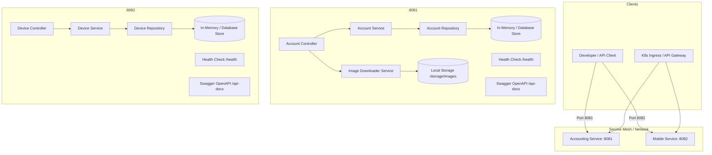

# Enterprise Microservices Development Environment

A production-grade, microservice-based architecture featuring two decoupled services: **Accounting Service** (Port 8081) and **Mobile Service** (Port 8082). Built with TypeScript, Express.js, clean layered architecture, containerized with Docker, orchestrated via Docker Compose, and prepared for Kubernetes deployment.

---

## 🏛️ Architecture Overview



---

## 📦 Project Structure

```
├── accounting-service/                  # Accounting Service (Port 8081)
│   ├── src/
│   │   ├── config/                      # Environment-specific configs (dev, test, prod)
│   │   │   ├── index.ts
│   │   │   ├── development.ts
│   │   │   ├── test.ts
│   │   │   └── production.ts
│   │   ├── controllers/                 # HTTP layer & request routing
│   │   │   ├── account.controller.ts
│   │   │   └── health.controller.ts
│   │   ├── services/                    # Business logic & image downloader
│   │   │   ├── account.service.ts
│   │   │   └── image-downloader.service.ts
│   │   ├── repositories/                # Data persistence abstraction
│   │   │   ├── account.repository.ts
│   │   │   └── in-memory-account.repository.ts
│   │   ├── models/                      # Domain entities & Zod DTO schemas
│   │   │   └── account.model.ts
│   │   ├── middlewares/                 # Logging, validation, error handling
│   │   │   ├── error-handler.middleware.ts
│   │   │   ├── request-logger.middleware.ts
│   │   │   └── validate.middleware.ts
│   │   ├── utils/                       # Winston structured JSON logger
│   │   │   └── logger.ts
│   │   ├── docs/                        # OpenAPI 3.0 / Swagger specifications
│   │   │   └── swagger.ts
│   │   ├── app.ts                       # Express application bootstrap
│   │   └── server.ts                    # HTTP server & graceful shutdown
│   ├── tests/                           # Unit and Integration test suites
│   │   ├── unit/
│   │   │   ├── account.service.test.ts
│   │   │   └── image-downloader.service.test.ts
│   │   └── integration/
│   │       ├── account.api.test.ts
│   │       └── health.api.test.ts
│   ├── Dockerfile                       # Multi-stage production container
│   ├── .dockerignore
│   ├── .env.example
│   ├── package.json
│   ├── tsconfig.json
│   └── jest.config.js
│
├── mobile-service/                      # Mobile Service (Port 8082)
│   ├── src/
│   │   ├── config/                      # Dev, test, prod configurations
│   │   ├── controllers/                 # DeviceController & HealthController
│   │   ├── services/                    # DeviceService
│   │   ├── repositories/                # DeviceRepository & sample seed store
│   │   ├── models/                      # Device models & Zod validation
│   │   ├── middlewares/                 # Error handling, request logger, validator
│   │   ├── utils/                       # Structured logger
│   │   ├── docs/                        # OpenAPI 3.0 specs
│   │   ├── app.ts
│   │   └── server.ts
│   ├── tests/
│   │   ├── unit/
│   │   │   └── device.service.test.ts
│   │   └── integration/
│   │       ├── device.api.test.ts
│   │       └── health.api.test.ts
│   ├── Dockerfile
│   ├── .dockerignore
│   ├── .env.example
│   ├── package.json
│   ├── tsconfig.json
│   └── jest.config.js
│
├── k8s/                                 # Kubernetes Manifests
│   ├── namespace.yaml                   # Dedicated 'microservices' namespace
│   ├── accounting-service/
│   │   ├── configmap.yaml               # Accounting ConfigMap
│   │   ├── deployment.yaml              # 2 Replicas, probes, resources, volumes
│   │   └── service.yaml                 # ClusterIP service on 8081
│   └── mobile-service/
│       ├── configmap.yaml               # Mobile ConfigMap
│       ├── deployment.yaml              # 2 Replicas, probes, resources
│       └── service.yaml                 # ClusterIP service on 8082
│
├── docker-compose.yml                   # Multi-service local container orchestration
├── .gitignore
└── README.md
```

---

## 🚀 Quick Start (Local Development)

### Prerequisites
- [Node.js](https://nodejs.org/) v20+ or v22+
- [npm](https://www.npmjs.com/) v10+
- (Optional) [Docker Desktop](https://www.docker.com/)

### 1. Run Accounting Service (Port 8081)
```bash
cd accounting-service
npm install
npm run dev
```
- **Service Root**: `http://localhost:8081`
- **Health Check**: `http://localhost:8081/health`
- **Swagger Documentation**: `http://localhost:8081/api-docs`

### 2. Run Mobile Service (Port 8082)
In a separate terminal:
```bash
cd mobile-service
npm install
npm run dev
```
- **Service Root**: `http://localhost:8082`
- **Health Check**: `http://localhost:8082/health`
- **Swagger Documentation**: `http://localhost:8082/api-docs`

---

## 🧪 Running Automated Tests

Both services include Jest unit and integration test suites using Supertest.

### Accounting Service Tests:
```bash
cd accounting-service
npm test
```

### Mobile Service Tests:
```bash
cd mobile-service
npm test
```

---

## 🐳 Docker & Docker Compose

### Single-Command Startup
To build and spin up both microservices in an isolated Docker bridge network:
```bash
docker compose up --build
```

### Stop Services
```bash
docker compose down
```

---

## ☸️ Kubernetes Deployment

The project provides modular Kubernetes YAML manifests organized by service in `k8s/`.

### 1. Create Namespace
```bash
kubectl apply -f k8s/namespace.yaml
```

### 2. Deploy Accounting Service
```bash
kubectl apply -f k8s/accounting-service/configmap.yaml
kubectl apply -f k8s/accounting-service/deployment.yaml
kubectl apply -f k8s/accounting-service/service.yaml
```

### 3. Deploy Mobile Service
```bash
kubectl apply -f k8s/mobile-service/configmap.yaml
kubectl apply -f k8s/mobile-service/deployment.yaml
kubectl apply -f k8s/mobile-service/service.yaml
```

### 4. Verify Kubernetes Pods and Services
```bash
kubectl get pods -n microservices
kubectl get services -n microservices
```

---

## 📑 REST API Documentation & Sample Payloads

### 1. Accounting Service (`http://localhost:8081`)

#### `GET /health`
Returns service health, uptime, environment, and process memory stats.
```bash
curl http://localhost:8081/health
```
**Response (200 OK):**
```json
{
  "status": "UP",
  "timestamp": "2026-09-10T11:00:00.000Z",
  "service": "accounting-service",
  "environment": "development",
  "uptimeSeconds": 45,
  "system": {
    "nodeVersion": "v24.15.0",
    "platform": "win32",
    "memoryUsageMb": {
      "rss": 42.15,
      "heapTotal": 18.25,
      "heapUsed": 12.80
    }
  }
}
```

---

#### `POST /accounts/create`
Creates a new account with validation and optional automatic image download for the avatar.
```bash
curl -X POST http://localhost:8081/accounts/create \
  -H "Content-Type: application/json" \
  -d '{
    "accountName": "Global Ventures Capital",
    "accountType": "INVESTMENT",
    "initialBalance": 750000.00,
    "currency": "USD",
    "email": "invest@globalventures.com",
    "avatarUrl": "https://picsum.photos/300/300",
    "downloadAvatar": true
  }'
```
**Response (201 Created):**
```json
{
  "success": true,
  "message": "Account created successfully",
  "data": {
    "id": "e7b0d912-87c2-48df-9769-df4101ebc96f",
    "accountNumber": "ACC-48291",
    "accountName": "Global Ventures Capital",
    "accountType": "INVESTMENT",
    "balance": 750000.00,
    "currency": "USD",
    "status": "ACTIVE",
    "email": "invest@globalventures.com",
    "avatarUrl": "https://picsum.photos/300/300",
    "avatarLocalPath": "/app/storage/images/img_3f892a01.jpg",
    "createdAt": "2026-09-10T11:00:00.000Z",
    "updatedAt": "2026-09-10T11:00:00.000Z"
  }
}
```

---

#### `GET /accounts`
Lists all accounts in the repository (includes pre-seeded sample data).
```bash
curl http://localhost:8081/accounts
```
**Response (200 OK):**
```json
{
  "success": true,
  "count": 2,
  "data": [
    {
      "id": "9b1deb4d-3b7d-4bad-9bdd-2b0d7b3dcb6d",
      "accountNumber": "ACC-10001",
      "accountName": "Acme Corp Operating Account",
      "accountType": "BUSINESS",
      "balance": 154500.5,
      "currency": "USD",
      "status": "ACTIVE",
      "email": "finance@acmecorp.com"
    },
    {
      "id": "1f98c8c2-491a-4d22-b5e7-2b36a19f2910",
      "accountNumber": "ACC-10002",
      "accountName": "Jane Doe Personal Savings",
      "accountType": "SAVINGS",
      "balance": 12850.75,
      "currency": "USD",
      "status": "ACTIVE",
      "email": "jane.doe@example.com"
    }
  ]
}
```

---

#### `GET /accounts/:id`
Retrieves account by UUID.
```bash
curl http://localhost:8081/accounts/9b1deb4d-3b7d-4bad-9bdd-2b0d7b3dcb6d
```
**Response (200 OK):**
```json
{
  "success": true,
  "data": {
    "id": "9b1deb4d-3b7d-4bad-9bdd-2b0d7b3dcb6d",
    "accountNumber": "ACC-10001",
    "accountName": "Acme Corp Operating Account",
    "accountType": "BUSINESS",
    "balance": 154500.5,
    "currency": "USD",
    "status": "ACTIVE",
    "email": "finance@acmecorp.com",
    "createdAt": "2026-08-11T11:00:00.000Z",
    "updatedAt": "2026-08-11T11:00:00.000Z"
  }
}
```

---

#### `POST /accounts/download-image`
Downloads an image file from a configurable URL and stores it on the local server filesystem.
```bash
curl -X POST http://localhost:8081/accounts/download-image \
  -H "Content-Type: application/json" \
  -d '{
    "imageUrl": "https://picsum.photos/400/300",
    "accountId": "9b1deb4d-3b7d-4bad-9bdd-2b0d7b3dcb6d"
  }'
```
**Response (200 OK):**
```json
{
  "success": true,
  "message": "Image downloaded and stored successfully",
  "data": {
    "originalUrl": "https://picsum.photos/400/300",
    "localPath": "C:\\Users\\...\\storage\\images\\img_9b8c7e12-3210.jpg",
    "fileName": "img_9b8c7e12-3210.jpg",
    "fileSizeBytes": 28412,
    "contentType": "image/jpeg",
    "downloadedAt": "2026-09-10T11:01:23.456Z"
  }
}
```

---

### 2. Mobile Service (`http://localhost:8082`)

#### `GET /health`
Returns service health and system metrics.
```bash
curl http://localhost:8082/health
```

---

#### `POST /devices`
Registers a mobile device with validation.
```bash
curl -X POST http://localhost:8082/devices \
  -H "Content-Type: application/json" \
  -d '{
    "deviceId": "DEV-IPH-882",
    "name": "VP Product iPhone",
    "model": "iPhone 16 Pro",
    "manufacturer": "Apple",
    "osVersion": "iOS 18.2",
    "status": "ACTIVE"
  }'
```
**Response (201 Created):**
```json
{
  "success": true,
  "message": "Device registered successfully",
  "data": {
    "id": "7a35e912-1f4a-44c3-b09a-981240c0b91e",
    "deviceId": "DEV-IPH-882",
    "name": "VP Product iPhone",
    "model": "iPhone 16 Pro",
    "manufacturer": "Apple",
    "osVersion": "iOS 18.2",
    "status": "ACTIVE",
    "createdAt": "2026-09-10T11:02:00.000Z",
    "updatedAt": "2026-09-10T11:02:00.000Z"
  }
}
```

---

#### `GET /devices`
Lists all devices. Supports filtering by query parameter (e.g. `?manufacturer=Apple` or `?status=ACTIVE`).
```bash
curl "http://localhost:8082/devices?manufacturer=Apple"
```
**Response (200 OK):**
```json
{
  "success": true,
  "count": 1,
  "data": [
    {
      "id": "4a1e948c-7f5b-4ec2-a279-79f826ce5a78",
      "deviceId": "DEV-IPH-001",
      "name": "Executive iPhone",
      "model": "iPhone 16 Pro Max",
      "manufacturer": "Apple",
      "osVersion": "iOS 18.2",
      "status": "ACTIVE",
      "createdAt": "2026-07-27T11:00:00.000Z",
      "updatedAt": "2026-07-27T11:00:00.000Z"
    }
  ]
}
```

---

#### `GET /devices/:id`
Retrieves device details using either the internal UUID or the unique hardware `deviceId`.
```bash
curl http://localhost:8082/devices/DEV-IPH-001
```
**Response (200 OK):**
```json
{
  "success": true,
  "data": {
    "id": "4a1e948c-7f5b-4ec2-a279-79f826ce5a78",
    "deviceId": "DEV-IPH-001",
    "name": "Executive iPhone",
    "model": "iPhone 16 Pro Max",
    "manufacturer": "Apple",
    "osVersion": "iOS 18.2",
    "status": "ACTIVE",
    "createdAt": "2026-07-27T11:00:00.000Z",
    "updatedAt": "2026-07-27T11:00:00.000Z"
  }
}
```

---

## ⚙️ Configuration Hierarchy

Each service evaluates configuration in three hierarchical tiers:
1. **Base Defaults** (`src/config/development.ts`, `src/config/test.ts`, `src/config/production.ts`) chosen via `NODE_ENV`.
2. **Local Environment File** (`.env` file in service root).
3. **Container / Kubernetes Environment Variables** (Injected via `ConfigMap` or OS environment).

| Variable | Default (Dev) | Description |
|---|---|---|
| `NODE_ENV` | `development` | Active environment: `development`, `test`, `production` |
| `PORT` | `8081` (Accounting) / `8082` (Mobile) | HTTP Server Listening Port |
| `LOG_LEVEL` | `debug` | Winston log filter: `debug`, `info`, `warn`, `error` |
| `IMAGE_STORAGE_PATH` | `./storage/images` | Storage folder for downloaded media (Accounting Service) |
| `DEFAULT_IMAGE_URL` | `https://picsum.photos/400/300` | Fallback URL for image download |
| `IMAGE_DOWNLOAD_TIMEOUT_MS` | `10000` | HTTP client timeout for image download |
| `MAX_IMAGE_SIZE_BYTES` | `10485760` (10MB) | Maximum allowed image download payload |

---

## 🔒 Enterprise Features

- **Correlation Tracing**: Every request is assigned an `X-Correlation-Id` header (propagated through logs).
- **Zod Schema Validation**: Request bodies are strictly validated before hitting services.
- **Graceful Shutdown**: Intercepts `SIGTERM` and `SIGINT` to safely drain open HTTP sockets before exiting.
- **Security Hardened**: Helmet enabled for security headers, CORS enabled with configurable policies.
- **Interactive OpenAPI 3.0 Specs**: Self-documenting Swagger UI embedded in both services.
